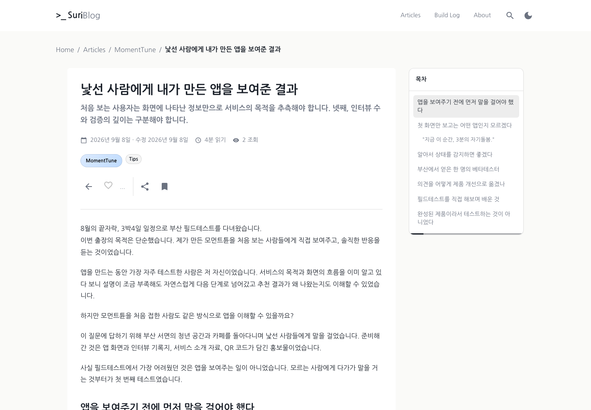
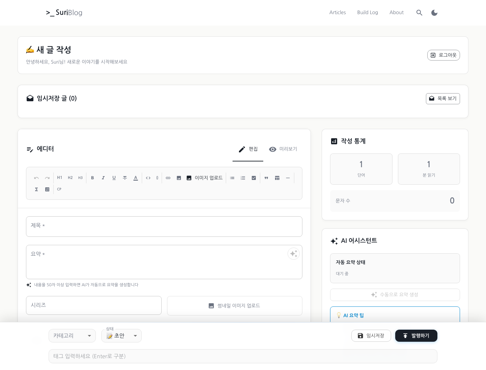
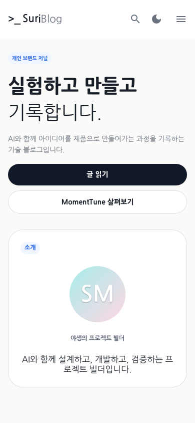
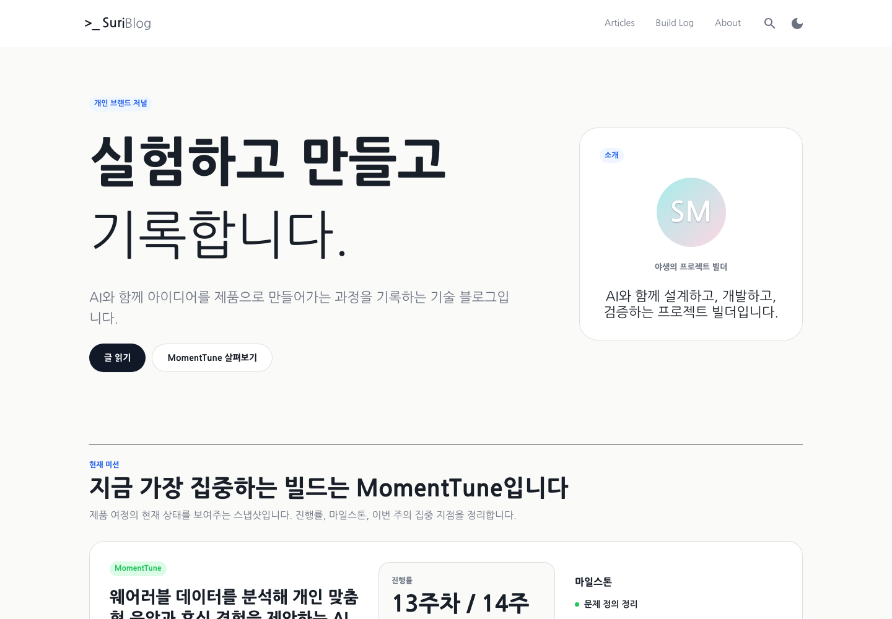

# SuriBlog

**Next.js·React·TypeScript로 콘텐츠 작성·발행부터 반응형 읽기 화면, SEO와 테스트까지 구현한 개인 기술 블로그입니다.**

MomentTune 제작기와 AI 도구 활용, 개인 프로젝트의 개발 과정을 기록하기 위해 만들었습니다. 마크다운 편집기의 상태관리와 자동 저장, 반응형 콘텐츠 탐색, 서버 컴포넌트 기반 데이터 조회와 SEO, 사용자 상호작용 테스트를 구현했으며, 관리자 인증·게시글 저장 API와 Vercel 배포까지 연결했습니다.

[서비스 보기](https://suri-blog.vercel.app) · [글 목록](https://suri-blog.vercel.app/articles) · [작성자 소개](https://suri-blog.vercel.app/about)

## Preview

| Article | Admin Editor |
| ------- | ------------ |
|  |  |

| Mobile | Desktop |
| ------ | ------- |
|  |  |

## 주요 구현

| 사용자 관점의 과제 | 프론트엔드 구현 | 관련 코드 |
| --- | --- | --- |
| 긴 글에서도 현재 위치를 파악하고 원하는 문단으로 이동하기 | 스크롤에 연동된 목차, 활성 항목 표시, 모바일·데스크톱 목차 배치 | [TableOfContents](src/components/TableOfContents.tsx) |
| 작성 중인 내용을 보존하고 저장 상태를 확인하기 | 마크다운 편집·미리보기, 자동 저장 상태 표시, 로컬 백업과 복원 대화상자 | [AdminPostEditor](src/components/AdminPostEditor.tsx) |
| 이미지를 넣은 뒤에도 편집을 이어가기 | 커서 위치에 이미지 마크다운 삽입, 포커스 복원, 업로드 중 동작 제한 | [이미지 업로드 처리](src/components/AdminPostEditor.tsx) |
| 글 내용이 검색·공유 화면에도 반영되기 | 서버에서 글 조회, 동적 메타데이터, canonical·구조화 데이터 생성 | [글 상세 레이아웃](src/app/posts/[slug]/layout.tsx) |
| UI를 변경해도 주요 사용 흐름이 유지되기 | 컴포넌트 상호작용 테스트, 실제 브라우저 탐색·모바일 표시 테스트 | [컴포넌트 테스트](src/components/__tests__) · [E2E](e2e/post-detail.spec.ts) |

## 프론트엔드 설계와 구현

### 1. 읽기 화면과 브라우저 상호작용의 경계

글 상세 페이지는 서버 컴포넌트에서 발행된 글을 조회하고, 목차·좋아요·댓글처럼 브라우저 상태와 이벤트를 사용하는 영역은 별도 컴포넌트로 구성했습니다. 페이지 데이터 조회와 사용자 상호작용을 구분해 각 코드의 역할을 드러냅니다.

마크다운 제목을 추출하는 공통 유틸리티를 본문 렌더러와 목차에서 함께 사용합니다. 본문의 제목 ID와 목차의 이동 대상을 연결하고, 현재 스크롤 위치에 해당하는 항목을 표시합니다.

[글 상세 페이지](src/app/posts/[slug]/page.tsx) · [마크다운 렌더러](src/components/PostMarkdown.tsx) · [제목 추출 로직](src/lib/markdownHeadings.ts)

### 2. 작성 흐름을 고려한 상태 관리와 비동기 피드백

관리자 편집기는 입력값뿐 아니라 저장·업로드·미리보기 상태를 함께 관리합니다. 작성자가 작업 중인 내용을 잃거나 요청 완료 전에 다음 동작을 수행하는 상황을 줄이는 데 초점을 맞췄습니다.

- 입력 변경 후 30초 동안 추가 변경이 없으면 자동 저장을 예약하고, 변경·언마운트 시 이전 타이머를 정리합니다.
- 폼 데이터를 `localStorage`에 백업하고, 새 글 작성 화면에서 이전 내용의 복원 여부를 선택할 수 있게 합니다.
- 저장 중·저장 완료·실패 상태와 마지막 저장 시간을 화면에 표시합니다.
- 로컬 이미지를 업로드하면 본문 커서 위치에 마크다운을 삽입하고 편집기로 포커스를 돌려줍니다.
- 파일 형식과 크기를 클라이언트에서 확인하며, 서버 검증 실패도 사용자에게 전달합니다. 업로드 중에는 발행·임시저장·미리보기 전환 버튼을 비활성화합니다.

현재 편집기의 폼과 저장 로직은 한 컴포넌트에 모여 있습니다. 향후 변경 범위가 커지면 자동 저장·복원 로직을 커스텀 훅으로 분리하고, 관리자 편집기의 통합 테스트를 보강할 수 있습니다.

[관리자 편집기](src/components/AdminPostEditor.tsx) · [공통 이미지 검증](src/lib/image-upload.ts)

### 3. 반응형 레이아웃과 목차 접근성

Material UI의 breakpoint별 스타일로 글 상세 화면의 정보 배치를 조정했습니다. 데스크톱에서는 본문 옆에 고정되는 목차를 제공하고, 좁은 화면에서는 본문 안에 목차를 배치합니다. 이전·다음 글 카드도 화면 크기에 따라 열 구성이 달라집니다.

목차는 `aside`와 버튼 요소를 사용하며, 접기 버튼에 `aria-expanded`·`aria-controls`를 지정했습니다. 목차 항목에 키보드 포커스 스타일을 정의해, 마우스 외의 탐색 방식도 고려했습니다.

[반응형 글 상세 화면](src/app/posts/[slug]/page.tsx) · [목차 UI](src/components/TableOfContents.tsx)

### 4. 콘텐츠 데이터와 연결한 SEO

게시글의 제목·설명·썸네일·발행일·수정일을 Next.js 메타데이터에 반영합니다. `BlogPosting`·`BreadcrumbList` JSON-LD와 canonical URL을 생성하고, sitemap·RSS로 공개 콘텐츠를 제공합니다. 화면 구현과 함께 검색·공유 시 전달되는 정보도 관리합니다.

[글 메타데이터](src/app/posts/[slug]/layout.tsx) · [SEO 유틸리티](src/lib/seo.ts) · [SEO 체크리스트](docs/SEO_CHECKLIST.md)

### 5. 사용자 동작을 기준으로 나눈 테스트

컴포넌트 테스트에서는 입력·클릭·상태 변경을 확인하고, E2E에서는 실제 페이지의 콘텐츠·이동·메타데이터를 검증합니다. 테스트 도구의 역할을 나누어 UI 단위 동작과 브라우저에서의 연결 흐름을 확인할 수 있게 했습니다.

| 검증 계층 | 구현된 검증 범위 | 근거 |
| --- | --- | --- |
| 컴포넌트 | 마크다운 편집기 입력·미리보기·저장 콜백, 검색 필터, 태그, 테마, 글 뷰어 | [Testing Library 테스트](src/components/__tests__) |
| 브라우저 E2E | 홈·글 상세 표시, 관련·인접 글 이동, 모바일 본문 표시, 비공개 글 fixture의 404, 콘솔 오류 | [Playwright 시나리오](e2e/post-detail.spec.ts) |
| 단위·API | 게시글 조회·SEO 로직, 파일 검증, 업로드 인증, 이미지 저장·조회 응답 | [Jest 테스트](src/lib/__tests__) |

컴포넌트 테스트의 `MarkdownEditor`와 실제 관리자 화면의 `AdminPostEditor`는 별도 컴포넌트입니다. 테스트 실행 조건과 설정은 [테스트 가이드](docs/TESTING.md)에 정리했습니다.

## 화면을 뒷받침하는 데이터 구조

게시글 CRUD API는 요청 처리, 유스케이스, 저장소 구현을 구분합니다. 공개 글 상세 화면은 별도 서버 조회 함수를 통해 DB의 발행된 글을 먼저 조회하고, 해당 글이 없거나 DB 조회가 실패하면 파일 기반 콘텐츠를 조회합니다. 두 경로는 화면에 전달할 때 `PostEntity` 형식으로 맞춥니다.

UI·요청 처리·비즈니스 로직·저장소 구현을 분리해 각 계층의 책임을 구분했습니다.

```text
공개 글 상세 페이지
└─ 서버 조회 함수
   ├─ PostgreSQL
   └─ 파일 콘텐츠 (대체 조회)

관리자 편집기
├─ 게시글 API → Use Case → PostRepository → Prisma → PostgreSQL
└─ 이미지 업로드 API → PostgreSQL → 이미지 조회 URL
```

이미지는 배포 인스턴스의 로컬 디스크 대신 PostgreSQL에 저장합니다. 본문과 썸네일이 같은 API를 사용하며, 관리자 인증과 크기·MIME·시그니처 검증을 거칩니다. 별도 스토리지 계정 없이 운영할 수 있지만 DB·백업 용량이 증가하므로, 사용량이 커지면 객체 스토리지 분리를 검토할 수 있습니다.

[공개 글 조회](src/lib/post-detail.ts) · [API 핸들러](src/infrastructure/api/posts.ts) · [저장소 구현](src/repositories/PrismaPostRepository/index.ts) · [이미지 업로드 설계](docs/image-uploads.md)

## 기술 스택

| 영역 | 기술 |
| --- | --- |
| 애플리케이션 | Next.js 15 App Router, React 19, TypeScript |
| UI | Material UI, Emotion, SCSS |
| 데이터 | PostgreSQL, Prisma ORM |
| 콘텐츠 | react-markdown, remark-gfm, remark-breaks, rehype-highlight |
| 인증 | 관리자 비밀번호 인증, JWT |
| 테스트 | Jest, Testing Library, Playwright |
| 배포 | Vercel |

## 코드 살펴보기

```text
src/app             공개·관리자 페이지, API Route, sitemap·RSS
src/components      편집기, 마크다운 렌더러, 탐색·공통 UI
src/entities        게시글 도메인 타입
src/usecases        게시글 유스케이스
src/repositories    저장소 인터페이스와 Prisma 구현
src/infrastructure  게시글 API 요청 처리
src/lib             인증, SEO, 콘텐츠 조회, 이미지 검증
prisma              DB 스키마, 마이그레이션, 시드
scripts             콘텐츠 운영, DB·이미지 검증, 백업 도구
e2e                브라우저 테스트
docs               설계·운영·검증 문서
```

주요 화면은 `/articles`, `/posts/[slug]`, `/categories/[slug]`, `/tags/[slug]`에서 확인할 수 있습니다. 글 관리는 `/admin`에서 시작합니다.

## 로컬 실행

Node.js와 npm, 개발용 PostgreSQL 데이터베이스가 필요합니다.

1. `.env.example`을 `.env`로 복사하고 아래 필수 항목을 설정합니다. Next.js와 Prisma CLI가 같은 DB 설정을 사용하도록 `.env`를 기준으로 구성합니다.
2. 의존성을 설치하고 개발 DB에 마이그레이션을 적용합니다.
3. 개발 서버를 실행하고 `http://localhost:3000`에 접속합니다.

```bash
npm install
npm run db:migrate:deploy
npm run dev
```

샘플 데이터가 필요한 개발 DB에서는 `npm run db:seed`를 실행할 수 있습니다.

| 환경변수 | 용도 |
| --- | --- |
| `DATABASE_URL` | PostgreSQL 연결 |
| `BLOG_ADMIN_PASSWORD` | 관리자 로그인 비밀번호 |
| `JWT_SECRET` | 관리자 토큰 서명 |
| `NEXT_PUBLIC_SITE_URL` | canonical·sitemap·RSS·공유 URL의 기준 주소 |
| `NEXT_PUBLIC_GOOGLE_SITE_VERIFICATION` | 선택: Search Console 인증 |
| `NEXT_PUBLIC_GA_ID` | 선택: Google Analytics 4 |
| `EMAIL_USER`, `EMAIL_PASS` | 선택: 문의 메일 전송 |

로컬에서는 `NEXT_PUBLIC_SITE_URL=http://localhost:3000`으로 설정합니다. 전체 설정 항목은 [.env.example](.env.example)을 참고하세요. 실제 비밀번호·연결 문자열·토큰은 저장소에 커밋하지 않고, 배포 시에는 Vercel 환경변수로 관리합니다.

## 검증과 배포

```bash
npm run type-check
npm run lint
npm run test:ci
npm run build
```

브라우저 테스트는 Playwright 브라우저 설치 후 `npm run test:e2e`로 실행합니다. 설정 방법은 [테스트 가이드](docs/TESTING.md)를 참고하세요.

Vercel 프로젝트와 환경변수를 연결한 뒤 다음 순서로 배포합니다. `db:migrate:deploy`는 명령을 실행하는 환경의 `DATABASE_URL`을 사용하므로 배포 대상 DB 설정을 먼저 확인합니다.

```bash
npm run db:migrate:status
npm run db:migrate:deploy
npm run deploy
```

`build`와 `vercel-build`는 Prisma Client를 생성하지만 DB 마이그레이션은 적용하지 않습니다. 배포 후에는 공개 글, 관리자 로그인, 이미지 업로드, `/sitemap.xml`, `/rss.xml`, `/robots.txt`를 확인합니다.

## 추가 문서

- [콘텐츠 구조](docs/CONTENT_ARCHITECTURE.md): DB·파일 콘텐츠 구성
- [콘텐츠 작업 흐름](docs/CONTENT_WORKFLOW.md): 작성·검토·발행 절차
- [이미지 업로드](docs/image-uploads.md): 저장 방식과 운영 시 고려사항
- [배포 가이드](docs/DEPLOYMENT.md): Vercel 설정과 배포 후 점검
